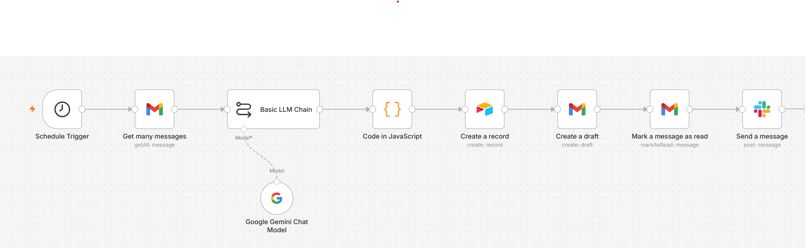
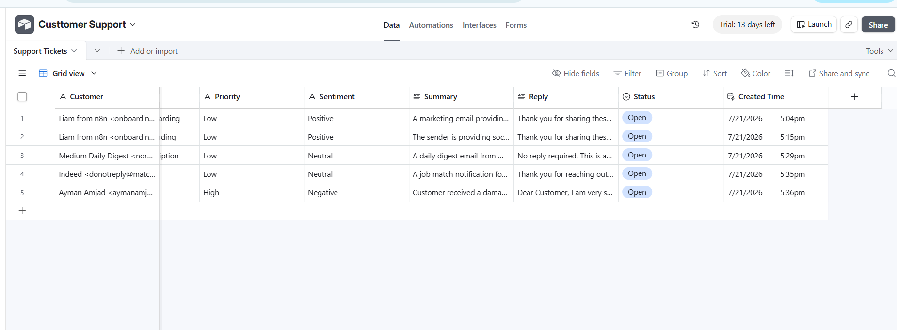

# 🤖 AI Customer Support Assistant (n8n + Gemini + Gmail + Airtable)

## Overview

An AI-powered customer support automation built with **n8n**, **Google Gemini**, **Gmail**, and **Airtable**.

The workflow automatically monitors incoming customer emails, uses AI to understand the request, classifies the issue, generates a professional response draft, stores the ticket in Airtable, and prepares a Gmail draft for human review.

This project demonstrates how AI can streamline customer support operations while keeping a human in the loop before responses are sent.

---

## Features

* 📩 Monitor incoming Gmail messages
* 🤖 Analyze customer emails using Google Gemini
* 🏷️ Automatically classify support requests
* ⚡ Detect priority level (Low, Medium, High)
* 😊 Analyze customer sentiment
* 📝 Generate professional reply drafts
* 📊 Store support tickets in Airtable
* 📧 Create Gmail reply drafts
* ✅ Prevent duplicate processing by marking emails as read

---

## Tech Stack

* n8n
* Google Gemini API
* Gmail API
* Airtable
* JSON Parsing

---

## Workflow

```text
Schedule Trigger
        ↓
Gmail (Get Messages)
        ↓
Google Gemini
        ↓
JSON Parser
        ↓
Airtable
        ↓
Create Gmail Draft
        ↓
Mark Email as Read
```

---

## AI Capabilities

The AI analyzes every incoming email and extracts:

* Category
* Priority
* Sentiment
* Summary
* Suggested Reply

Example output:

```json
{
  "category": "Complaint",
  "priority": "High",
  "sentiment": "Negative",
  "summary": "Customer received a damaged product.",
  "reply": "Hi John,\n\nI'm sorry to hear your item arrived damaged. We'd be happy to arrange a replacement..."
}
```

---

## Example Customer Email

**Input**

> Hi,

> I received my order today, but the item arrived broken.

> Can I get a replacement?

> Thanks,
> John

---

**AI Result**

* Category: Complaint
* Priority: High
* Sentiment: Negative
* Summary: Customer received a damaged item and requested a replacement.
* Draft Reply: Generated automatically by Gemini.

---

## Business Value

This automation helps businesses:

* Reduce manual support work
* Respond to customers faster
* Organize support tickets
* Maintain consistent responses
* Improve customer satisfaction
* Keep human approval before sending replies

---

## Repository Structure

```
ai-customer-support-assistant/
│
├── workflow.json
├── README.md
├── prompts/
│   └── support_prompt.md
├── screenshots/
│   ├── workflow.png
│   ├── airtable.png
│   ├── gmail.png
│   └── draft.png
└── docs/
    └── architecture.png
```

---

## 📸 Screenshots

### Workflow



### Airtable CRM



### Customer Email


* Multi-language support
* Human approval workflow
* CRM integration
* Analytics dashboard
* Ticket assignment automation

---

## Author

**Ayman Amjad**

AI Automation Developer

Building business automation solutions using n8n, AI, APIs, and modern workflow automation.
